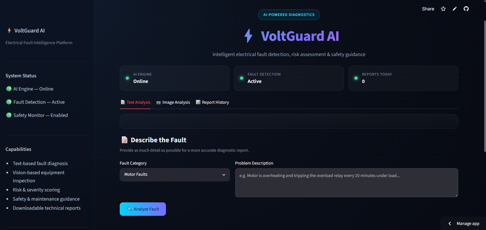
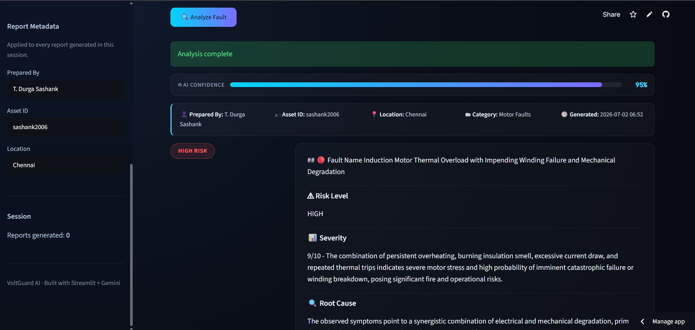
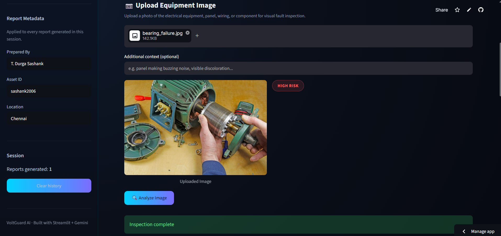

# ⚡ VoltGuard AI

### AI-Powered Industrial Safety Intelligence for Zero-Harm Operations

VoltGuard AI is an AI-powered industrial electrical fault detection platform that helps engineers identify equipment faults using both **text descriptions** and **equipment images**. The system analyzes faults using Google Gemini AI, evaluates risk levels, identifies root causes, and provides preventive maintenance recommendations to improve industrial safety and reduce equipment downtime.

---

## 🚀 Live Demo

🔗 Streamlit App: **<YOUR_STREAMLIT_URL>**

## 💻 GitHub Repository

🔗 https://github.com/durgasashanktalari-ai/VoltGuard-AI

---

# 🎯 Problem Statement

Industrial facilities depend on electrical equipment such as motors, transformers, switchgear, and electrical panels for uninterrupted operations. Traditional fault diagnosis is often manual, time-consuming, and dependent on experienced engineers. VoltGuard AI provides an intelligent solution by analyzing faults through AI and generating actionable maintenance recommendations to support safer industrial operations.

---

# ✨ Features

- 🤖 AI-Powered Fault Analysis
- 📷 Equipment Image Analysis
- ⚠️ Risk Severity Assessment
- 🔍 Root Cause Identification
- 📄 AI Technical Report Generation
- 🛠 Preventive Maintenance Suggestions
- 📊 Interactive Dashboard
- ⚡ Industrial Safety Monitoring

---

# 🛠 Technology Stack

- Python
- Streamlit
- Google Gemini AI
- Pillow
- Plotly
- Pandas

---

# 📸 Project Screenshots

## Dashboard



---

## Text Fault Analysis


---

## AI Analysis Result



---

## Image Analysis



---

# 📂 Project Structure

```text
VoltGuard-AI/
│
├── assets/
├── screenshots/
├── app_v3.py
├── requirements.txt
├── README.md
└── .gitignore
```

---

# ⚙ Installation

```bash
git clone https://github.com/durgasashanktalari-ai/VoltGuard-AI.git

cd VoltGuard-AI

pip install -r requirements.txt

streamlit run app_v3.py
```

---

# 🔮 Future Enhancements

- Predictive Maintenance using Historical Data
- IoT Sensor Integration
- Real-Time Equipment Monitoring
- PDF Report Export
- Mobile Application
- Multi-language Support

---

# 🎥 Demo

A complete demonstration of VoltGuard AI is included with the hackathon submission.

---

# 👨‍💻 Developed By

**Talari Durga Sashank**

Saveetha Engineering College

---

## ⭐ If you like this project, consider giving it a star on GitHub!
